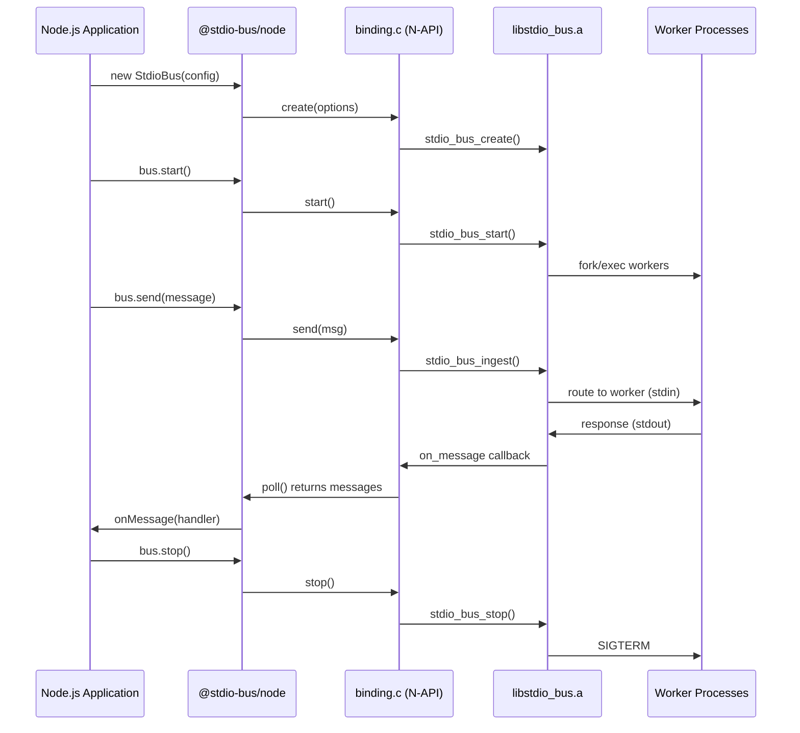

# @stdiobus/node

Native Node.js binding for stdio_bus - the AI agent transport layer.

[](https://www.npmjs.com/package/@stdiobus/node)

## Features

- **No external binary required** - Native addon includes libstdio_bus
- **High performance** - Direct C integration, no process spawning
- **Cross-platform** - Native on macOS/Linux, Docker on Windows
- **Multiple transport modes** - Embedded, TCP, or Unix socket
- **Session-based routing** - Automatic message routing to workers
- **Worker lifecycle management** - Automatic restart with backoff

## Installation

```bash
npm install @stdio-bus/node
```

Prebuilt binaries: macOS (x64, arm64), Linux (x64, arm64). Windows via Docker backend.

## Quick Start

### Embedded Mode (Default)

Messages are sent/received directly via the JavaScript API:

```javascript
const { StdioBus } = require('@stdio-bus/node');

const bus = new StdioBus({
  configPath: './config.json'
});

// Handle responses from workers
bus.onMessage((msg) => {
  const response = JSON.parse(msg);
  console.log('Response:', response);
});

await bus.start();

// Send a request
bus.send(JSON.stringify({
  jsonrpc: '2.0',
  id: '1',
  method: 'tools/list',
  params: {}
}));

// Or use the request() helper with automatic correlation
const result = await bus.request('tools/list', {});
console.log('Tools:', result);

await bus.stop();
```

### TCP Mode

Accept external client connections over TCP:

```javascript
const { StdioBus } = require('@stdio-bus/node');

const bus = new StdioBus({
  configPath: './config.json',
  listenMode: 'tcp',
  tcpHost: '0.0.0.0',
  tcpPort: 8080
});

await bus.start();
console.log('Listening on TCP port 8080');
console.log('Workers:', bus.getWorkerCount());

// Monitor connections
setInterval(() => {
  console.log('Connected clients:', bus.getClientCount());
}, 5000);

// Clients can connect with: nc localhost 8080
// And send NDJSON messages
```

### Unix Socket Mode

Accept connections via Unix domain socket:

```javascript
const { StdioBus } = require('@stdio-bus/node');

const bus = new StdioBus({
  configPath: './config.json',
  listenMode: 'unix',
  unixPath: '/tmp/stdio-bus.sock'
});

await bus.start();
console.log('Listening on /tmp/stdio-bus.sock');

// Clients can connect with: nc -U /tmp/stdio-bus.sock
```

## Configuration

Create a `config.json` file:

```json
{
  "pools": [
    {
      "id": "mcp-worker",
      "command": "node",
      "args": ["./worker.js"],
      "instances": 4
    }
  ],
  "limits": {
    "max_input_buffer": 1048576,
    "max_output_queue": 4194304,
    "max_restarts": 5,
    "restart_window_sec": 60
  }
}
```

## API Reference

### Constructor

```javascript
new StdioBus(options)
```

**Options:**

| Option | Type | Required | Default | Description |
|--------|------|----------|---------|-------------|
| `configPath` | string | Yes | - | Path to JSON configuration file |
| `backend` | string | No | `'auto'` | Backend: `'auto'`, `'native'`, or `'docker'` |
| `listenMode` | string | No | `'none'` | Transport mode: `'none'`, `'tcp'`, or `'unix'` (native only) |
| `tcpHost` | string | No | `'127.0.0.1'` | TCP bind address (native tcp mode) |
| `tcpPort` | number | Yes* | - | TCP port (*required for native tcp mode) |
| `unixPath` | string | Yes* | - | Unix socket path (*required for native unix mode) |
| `pollIntervalMs` | number | No | `10` | Polling interval (native only) |
| `logLevel` | number | No | `1` | Log level: 0=DEBUG, 1=INFO, 2=WARN, 3=ERROR (native only) |
| `docker` | object | No | - | Docker backend options (see Docker Mode section) |

**Backend selection (`backend` option):**
- `'auto'` (default): Uses native on macOS/Linux, docker on Windows
- `'native'`: Force native backend (fails on Windows)
- `'docker'`: Force Docker backend (works everywhere)

### Methods

#### `bus.getBackendType()`

Returns the backend being used: `'native'` or `'docker'`.

#### `bus.onMessage(handler)`

Register a message handler. Called for each message received from workers.

```javascript
bus.onMessage((msg) => {
  const data = JSON.parse(msg);
  console.log('Received:', data);
});
```

#### `bus.start(): Promise<void>`

Start the bus and spawn worker processes.

#### `bus.stop(timeoutSec?: number): Promise<void>`

Stop the bus gracefully. Workers receive SIGTERM and have `timeoutSec` seconds to exit (default: 30).

#### `bus.send(message: string): boolean`

Send a JSON-RPC message to workers. Returns true if queued successfully.

#### `bus.request(method, params?, options?): Promise<any>`

Send a request and wait for response with automatic correlation.

```javascript
const result = await bus.request('tools/list', {}, {
  timeout: 30000,      // Timeout in ms (default: 30000)
  sessionId: 'abc123'  // Optional session ID for routing
});
```

#### `bus.getState(): number`

Get current bus state:

| Constant | Value | Description |
|----------|-------|-------------|
| `BusState.CREATED` | 0 | Created but not started |
| `BusState.STARTING` | 1 | Workers being spawned |
| `BusState.RUNNING` | 2 | Running and accepting messages |
| `BusState.STOPPING` | 3 | Graceful shutdown in progress |
| `BusState.STOPPED` | 4 | Fully stopped |

#### `bus.getStats(): object`

Get statistics:

```javascript
{
  messagesIn: 100,       // Messages sent to workers
  messagesOut: 100,      // Messages received from workers
  bytesIn: 10240,        // Total bytes sent
  bytesOut: 20480,       // Total bytes received
  workerRestarts: 0,     // Number of worker restarts
  routingErrors: 0,      // Messages that couldn't be routed
  clientConnects: 5,     // Client connections (TCP/Unix modes)
  clientDisconnects: 2   // Client disconnections (TCP/Unix modes)
}
```

#### `bus.getWorkerCount(): number`

Get number of running workers.

#### `bus.getClientCount(): number`

Get number of connected clients (TCP/Unix modes only, returns 0 in embedded mode).

#### `bus.getListenMode(): string`

Get the listen mode: `'none'`, `'tcp'`, or `'unix'`.

#### `bus.isRunning(): boolean`

Check if bus is in RUNNING state.

#### `bus.destroy(): void`

Destroy the bus and release all resources.

### Constants

```javascript
const { BusState, ListenMode } = require('@stdio-bus/node');

// Bus states
BusState.CREATED   // 0
BusState.STARTING  // 1
BusState.RUNNING   // 2
BusState.STOPPING  // 3
BusState.STOPPED   // 4

// Listen modes
ListenMode.NONE    // 'none'
ListenMode.TCP     // 'tcp'
ListenMode.UNIX    // 'unix'
```

## Docker Mode (Windows & Cross-Platform)

Run stdio_bus in a Docker container. Required on Windows, optional on macOS/Linux.

```javascript
const { StdioBus } = require('@stdio-bus/node');

const bus = new StdioBus({
  configPath: './config.json',
  backend: 'docker',
  docker: {
    image: 'stdiobus/stdiobus:node20',
    pullPolicy: 'if-missing'
  }
});

await bus.start();
console.log('Backend:', bus.getBackendType()); // 'docker'

// Same API as native backend
const result = await bus.request('tools/list', {});
await bus.stop();
```

**Docker options:**

| Option | Default | Description |
|--------|---------|-------------|
| `image` | `stdiobus/stdiobus:node20` | Docker image to use |
| `pullPolicy` | `if-missing` | `never`, `if-missing`, or `always` |
| `enginePath` | `docker` | Path to docker CLI |
| `startupTimeoutMs` | `15000` | Container startup timeout |
| `containerNamePrefix` | `stdio-bus` | Container name prefix |
| `extraArgs` | `[]` | Extra `docker run` arguments |
| `env` | `{}` | Environment variables |

**Requirements:** [Docker Desktop](https://www.docker.com/products/docker-desktop) installed and running.

## Examples

### Echo Server (TCP)

```javascript
const { StdioBus } = require('@stdio-bus/node');

const bus = new StdioBus({
  configPath: './echo-config.json',
  listenMode: 'tcp',
  tcpHost: '0.0.0.0',
  tcpPort: 9000
});

await bus.start();
console.log('Echo server running on port 9000');

process.on('SIGINT', async () => {
  console.log('Shutting down...');
  await bus.stop();
  process.exit(0);
});
```

### MCP Proxy

```javascript
const { StdioBus } = require('@stdio-bus/node');

const bus = new StdioBus({
  configPath: './mcp-config.json',
  listenMode: 'unix',
  unixPath: '/tmp/mcp-proxy.sock'
});

await bus.start();
// Workers handle MCP protocol, clients connect via Unix socket
```

## Architecture



The C library handles:
- **Worker process management** - Fork/exec, monitoring, restart with backoff
- **Message routing** - Session-based routing with round-robin assignment
- **NDJSON framing** - Line-delimited JSON-RPC messages
- **Backpressure** - Per-connection output queues with limits
- **TCP/Unix listeners** - Accept external client connections

## License

Apache-2.0
